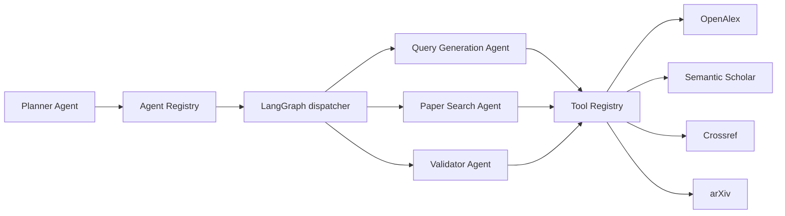
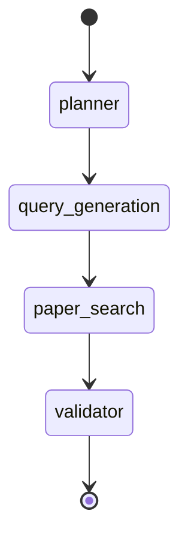

# Autonomous Research Workflow Architecture

The existing SLR query generator remains the legacy capability layer. The autonomous workflow is additive and is exposed under `/api/v1`; legacy FastAPI endpoints and UI behavior are unchanged.

## Registry-driven execution

The workflow imports only the `AgentRegistry`; it does not import concrete agent classes. Each agent resolves its capabilities from the `ToolRegistry`, which keeps external-provider clients out of agent code.

## Phase 1 graph

The Planner writes `execution_plan` using registered agent IDs. The graph then routes dynamically to the first incomplete registered agent. A later phase can add an agent to the registry without modifying the dispatcher.

## Durable state and memory

`ResearchWorkflowState` is serialized after every node to Supabase through `SharedWorkflowMemory`. The lifecycle is explicit:

`CREATED → PLANNING → QUERY_GENERATION → SEARCHING → SCREENING → DATA_EXTRACTION → QUALITY_ASSESSMENT → SYNTHESIS → REPORT_GENERATION → COMPLETED`

Failure and pause transitions are `FAILED` and `PAUSED`. Phase 1 reaches `COMPLETED` after query validation; later phases extend the plan with the remaining registered agents.

Use [001_research_workflow.sql](../migrations/001_research_workflow.sql) in Supabase before invoking the new API. Set `SUPABASE_URL` and `SUPABASE_SERVICE_ROLE_KEY` in the backend environment. The service-role key must never be sent to a browser.
